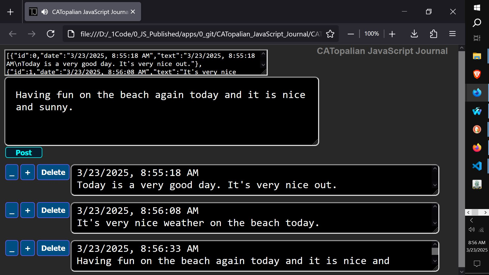

# CATopalian JavaScript Journal
A JavaScript App that enables the person to make journal entries and edit them.

USE APP: https://christopherandrewtopalian.github.io/CATopalian_JavaScript_Journal/CATopalian_JavaScript_Journal.html

  

---

How to Download this App
1. Click the green Code Button on this github page
2. Choose Download ZIP
3. Save the Zip File
4. Extract All
5. Double click the html file to start the App